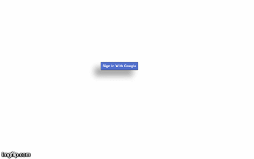

# Curriculum Authoring Tool

A react application which allows you to view stocks data with real time updates, beign served by a web socket based server. Few extra features of this SPA is Charts for showing stock trends, drag and drop to create your personalised watch list of stocks and historical data of any any stock.
## Live Tool

*[Stock Tool](https://proximity-stocksapp.netlify.app/)*

## Project Demo



### GIFs can't be paused, so,

### here is the [youtube video explaining the app features](https://youtu.be/Blsl-WBE3KU)

## Features

- [x] **Sign In - Sign out:** For users to start with the tool, they need to Sign in to the application using their google id.
- [x] **Stocks List:** List of all the stocks being sent by the web socket server. The list and prices get rugularly and dynamically updated, as the new values come by. The stock list also displays if the stock prices have increased or decreased, in percentage.
- [x] **Stock Trend Chart:** Option to see the how a particular stock's prices have been trending on a chart. Feature implemented using react-highcharts
- [x] **Stock History** Option to see history, in a tabular form, of price changes for any stock.
- [x] **Personal Watch List:** Drag and Drop stocks form stock list to create your own personalised Watch list, for your favourite stocks. Remove them at will.
- [x] **Search bar:** text based search box for searching through stocks in Stock List.

## Features which are in-developement:

- Test cases


## Libraries and Frameworks used

- React.js
- Firebase for google authetication
- node-sass
- Fontawesome Icons
- react-highcharts

## Liked the tool? Want to contribute? For getting started with the codebase:

The application uses es6.

```
$ git clone https://github.com/yashpriyam/teachers-authoring-cra.git
$ npm install
$ npm start
```
